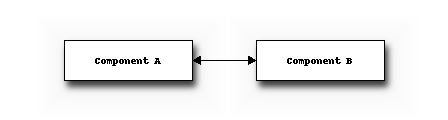

.. _sea:

Statistical Energy Analysis
###########################

.. toctree::
   :maxdepth: 2
   

This chapter provides some background on Statistical Energy Analysis

============
Introduction
============

Statistical Energy Analysis, normally abbreviated to SEA, is a method for
studying the vibroacoustic motion of a structure from an energy perspective. SEA
is used within vibroacoustics to model the flow of acoustic power through a
vibrating system. An example is modeling the vibrations in cars due to the
engine. SEA is generally used in the high-frequency region whereas
finite-element analysis is used in the low-frequency region. 

First step in performing an SEA is creating the geometry. Then, the relevant
:term:`components` are modeled as :term:`subsystems`, where each subsystem
represents one wave type. The subsystems are then connected through
:term:`couplings`. :term:`Power` is added into the system through
:term:`excitation` of one or more subsystems. :term:`Power dissipation` in
subsystems and couplings are modeled using :term:`loss factors`. Finally, a
single matrix composed of :term:`loss factors`, :term:`modal densities` and input
powers, is solved resulting in the modal energies of each subsystem, from which
their velocity or pressure levels can be calculated.

=================
Example SEA model
=================

Consider two components physically attached to each other.

The figure below shows a block diagram of how the different objects in a simple SEA model based on these two components are related. 
We assume one wave type exists per component, and so there is one subsystem per component.
Energy is allowed to flow from Subsystem A to Subsystem B via Coupling 1 and vice versa via Coupling 2.

.. graphviz::

    digraph sea {
      "Component A" -> "Subsystem A";
      "Component B" -> "Subsystem B";
     
      "Subsystem A" -> "Coupling 1" -> "Subsystem B";
      "Subsystem B" -> "Coupling 2" -> "Subsystem A";
    }

    
========================
SEA consistency relation
========================

The consistency relation is

.. math:: n_i \eta_c^{i,j} = n_j \eta_c^{j,i}
